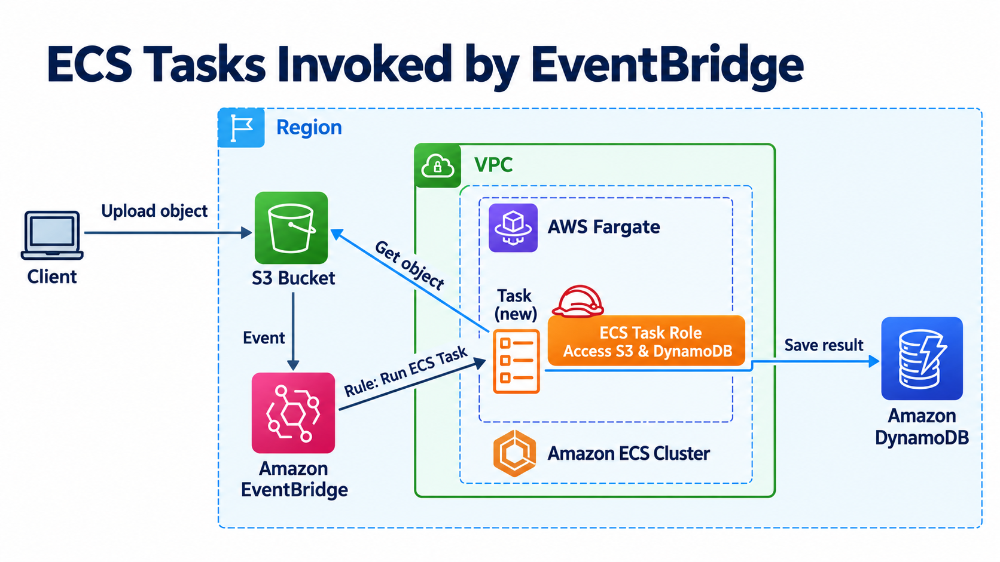
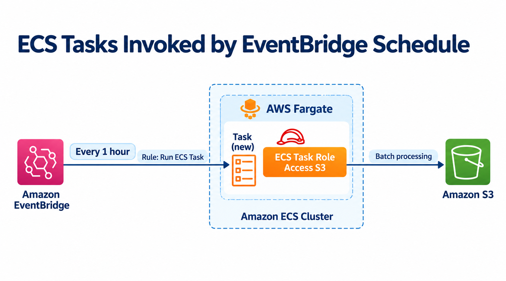
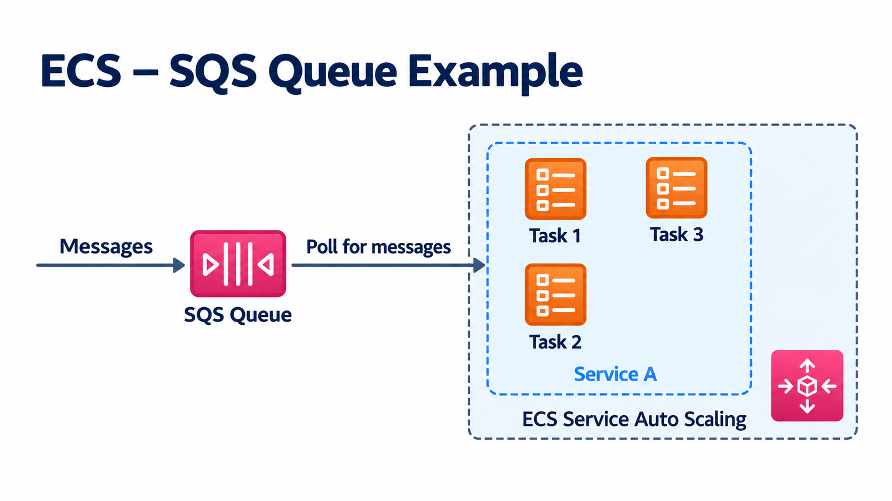
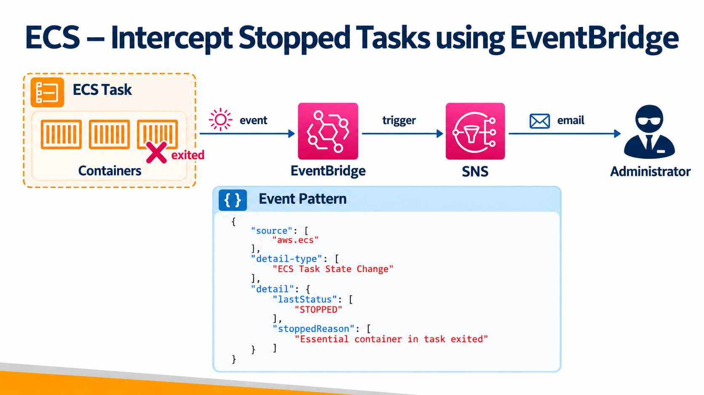

# ECS와 EventBridge

Amazon EventBridge는 특정 이벤트나 정해진 시간을 기준으로 ECS Task를
실행할 수 있습니다.

**항상 실행되는 ECS Service와 달리, 작업이 필요할 때만 Task를 시작하고 완료 후 종료할 수 있습니다.**

```text
이벤트 또는 시간 도달
        ↓
EventBridge
        ↓
ECS RunTask 호출
        ↓
ECS Task 실행 → 작업 완료 → 종료
```

## 사용하기 좋은 작업

- S3에 파일이 업로드된 뒤 이미지 변환을 실행하는 경우입니다.
- 매일 새벽 매출을 집계하거나 로그를 압축하는 경우입니다.
- CSV 파일을 받아 데이터베이스에 적재하는 경우입니다.
- 정해진 시간에 보고서 생성이나 메일 발송을 실행하는 경우입니다.

## EventBridge Rule과 Scheduler

| 구분      | EventBridge Rule                             | EventBridge Scheduler                            |
| --------- | -------------------------------------------- | ------------------------------------------------ |
| 실행 기준 | AWS 서비스 이벤트 또는 사용자 이벤트입니다.  | 시간, 주기, 한 번만 실행하는 시각입니다.         |
| 예시      | S3 Object Created 뒤 변환 Task를 실행합니다. | 매일 02:00에 배치 Task를 실행합니다.             |
| 설정 대상 | 이벤트 패턴과 ECS Task target을 설정합니다.  | 일정 표현식과 ECS `RunTask` target을 설정합니다. |

시간 기반 작업에는 EventBridge Scheduler를 사용합니다. Scheduler는
`rate`, `cron`, 한 번만 실행하는 `at` 표현식을 지원하고, 시간대를
지정할 수 있습니다. 예를 들어 대한민국 시간 기준 매일 새벽 2시에
실행하려면 `cron(0 2 * * ? *)`와 `Asia/Seoul` 시간대를 함께 설정합니다.

```text
S3 Object Created
        ↓
EventBridge Rule
        ↓
이미지 변환 ECS Task
        ↓
S3에 결과 저장 후 종료
```

## ECS Task target 설정

EventBridge Rule 또는 Scheduler에서 ECS Task를 target으로 추가할 때는
다음 값을 지정합니다.

| 설정                   | 예시                     | 설명                                                |
| ---------------------- | ------------------------ | --------------------------------------------------- |
| Cluster                | `batch-cluster`          | Task를 실행할 ECS 클러스터입니다.                   |
| Task definition        | `image-resize:3`         | 실행할 Task definition과 revision입니다.            |
| Launch type            | `FARGATE`                | Fargate 또는 EC2 용량 방식입니다.                   |
| Subnet, Security Group | private subnet, task SG  | Fargate의 `awsvpc` 네트워크 설정입니다.             |
| Task count             | `1`                      | 이벤트 한 건에서 실행할 Task 수입니다.              |
| Task role              | `image-resize-task-role` | Task 내부 애플리케이션이 S3 등에 접근할 권한입니다. |

- Fargate Task는 `awsvpc` 네트워크 모드를 사용하므로 subnet과 security group을 함께 지정해야 합니다.
- EC2 launch type은 클러스터의 남은 CPU와 메모리가 충분해야 실행됩니다.
- 용량이 부족하면 Task가 `PROVISIONING` 상태에 머물 수 있으므로, Capacity Provider와 ASG
  확장 설정을 함께 확인합니다.

## EventBridge 실행 역할

EventBridge가 ECS의 `RunTask` API를 호출하려면 EventBridge용 IAM
실행 역할이 필요합니다. 이 역할에는 대상 Task definition에 대한
`ecs:RunTask` 권한과, Task execution role 및 Task role을 전달하기 위한
`iam:PassRole` 권한이 필요합니다.

권한은 모든 리소스에 `*`를 허용하지 말고, 실제 클러스터와 Task definition,
Task role ARN으로 범위를 제한합니다. EventBridge 실행 역할과 Task role은
용도가 다릅니다. 전자는 Task를 **시작**하는 권한이고, 후자는 실행 중인
컨테이너가 S3, DynamoDB 같은 AWS 서비스를 **사용**하는 권한입니다.

## 샘플 구성도

S3 이미지 업로드 > 이벤트 브릿지 > 임시 타스크 생성 > S3에서 이미지 취득 > 다이나모 디비 저장


이벤트 브릿지가 매 1시간 마다 스케쥴링 > 임시 타스크 생성 > 작업 > S3


SQS에서 큐 메세지를 취득하여, ECS 서비스 오토 스케일링


ECS의 타스크가 정지 > 이벤트 브릿지 > SNS 트리거 > 관리자에게 이메일 발송


## 운영 시 주의할 점

- EventBridge는 같은 이벤트를 두 번 전달할 수 있으므로, 배치 작업은
  중복 실행되어도 결과가 안전하도록 idempotent하게 작성합니다.
- 실패한 Task는 ECS stopped reason과 CloudWatch Logs에서 원인을 확인합니다.
  EventBridge Rule 또는 Scheduler의 재시도와 DLQ 설정도 함께 검토합니다.
- 이벤트 입력값이 필요하면 Rule target의 입력 변환 또는 Task override로
  환경 변수·명령 인자를 전달합니다. 비밀번호나 토큰은 입력값에 넣지 않고
  Secrets Manager 또는 Parameter Store를 사용합니다.

관련 AWS 공식 문서:

- [EventBridge Scheduler로 ECS Task 실행](https://docs.aws.amazon.com/AmazonECS/latest/developerguide/tasks-scheduled-eventbridge-scheduler.html),
- [EventBridge의 ECS Task 실행 역할](https://docs.aws.amazon.com/AmazonECS/latest/developerguide/CWE_IAM_role.html),
- [EventBridge Scheduler 일정 표현식](https://docs.aws.amazon.com/scheduler/latest/UserGuide/schedule-types.html)
