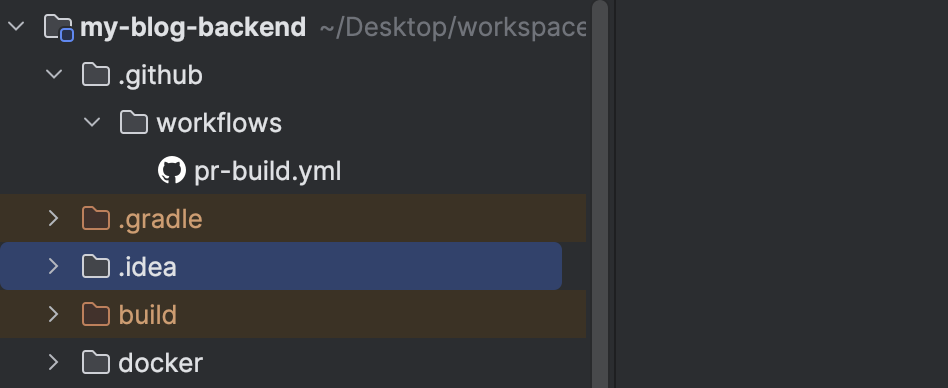
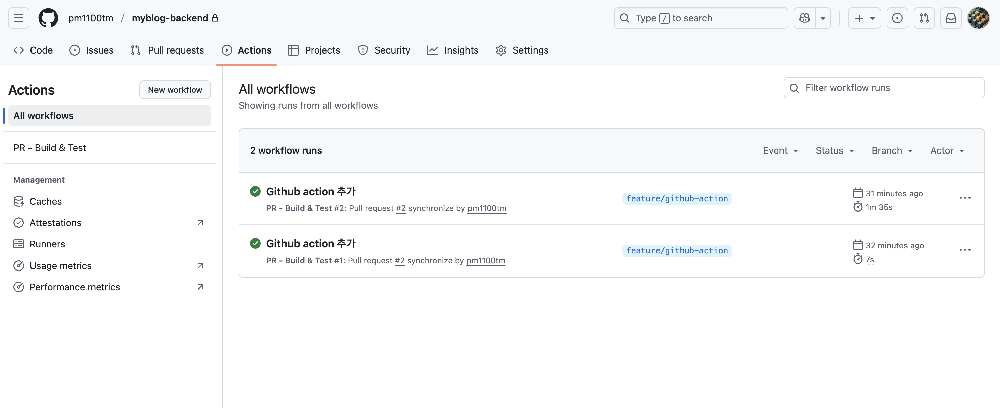
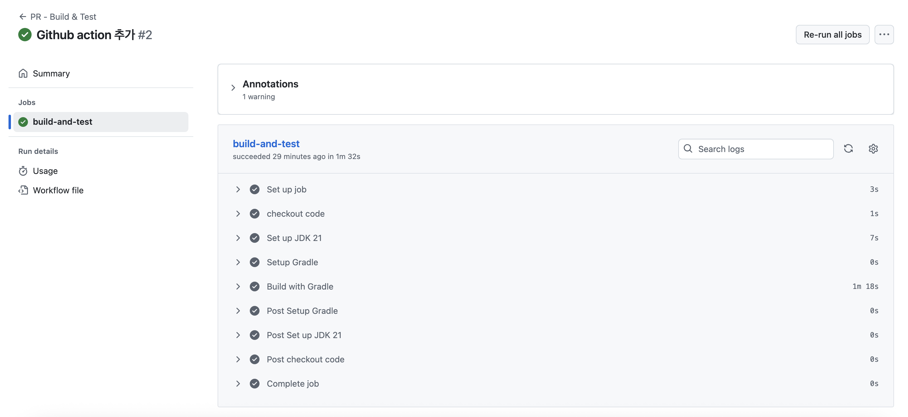

# 🚀 CI/CD with Github Action

Github Repository 의 Actions 탭에서 관련 파일을 만들어 설정할 수 있지만, 프로젝트에서 바로 파일을
만들어서 CI/CD 를 구축할 수 있습니다.

## 1. 프로젝트에 .yml 파일 생성

```shell
├── .github
│   ├── workflows
│   │   └── pr-build.yml
```

먼저 위와 같이 프로젝트 루트에 .gihub/workflows 폴더 아래에 pr-build.yml 파일을 만들어줍니다.

> 📚 파일명 pr-build.yml 은 임의로 지은 것이며, 해당 action 이 수행하는 바를 설명하도록 하였습니다.



## 2. .yml 파일 정의

각 line 이 의미하는 바는 주석으로 정리해두었습니다.

이 Action 의 목적은 feature 브랜치에서 작업한 뒤, main 브랜치에 pull request 가 올라왔을 때,
돌아가도록 하였으며, [컴파일 → 빌드 → 테스트] 과정이 정상적으로 수행되는지 검증합니다.

```yml
name: PR - Build & Test To develop # 워크플로우 명(Actions 탭에 표시)

on:
  push:
    branches:
      - develop
  pull_request:
    #    branches-ignore:
    #      - 'feature/**'
    branches:
      - develop
      # - 'feature/**' # feature/* 브랜치로 PR 올릴 때 실행
      # - 'fix/**'     # fix/* 브랜치로 PR 올릴 때 실행

jobs:
  build-and-test: # job 명
    runs-on: ubuntu-latest # 실행 환경(Github 이 제공하는 Ubuntu 최신 버전 VM)

    steps:
      # 1) 소스코드 체크아웃
      - name: checkout code
        uses: actions/checkout@v4 # 저장소 코드를 runner 로 가져옴

      # 2) JDK 21 설치
      - name: Set up JDK 21
        uses: actions/setup-java@v4 # GitHub 제공 JDK 설치 액션
        with:
          java-version: '21'        # 설치할 자바 버전
          distribution: 'corretto'  # JDK 배포판(temurin / corretto 가능)

      # 3) Gradle 캐시 설정(빌드 속도 향상)
      - name: Setup Gradle
        uses: gradle/actions/setup-gradle@v3 # Gradle Wrapper 캐시 자동 관리

      # 4) Gradle 빌드 실행 (테스트 포함)
      - name: Build with Gradle
        # clean: 이전 빌드 산출물 삭제, build: 컴파일 + 테스트 + jar 생성, --no-daemon: CI 환경에서는 백그라운드 데몬 실행 방지
        run: ./gradlew clean build --no-daemon
```

## 3. push / pull request

위의 작업을 feature/github-action 이라는 브랜치에서 작업하였습니다.

그 후의 작업은 아래와 같습니다.

- git push origin feature/github-action
- pull request [feature/github-action] to [develop]

이렇게 하면,

- develop 브랜치에 pull requset 를 생성할 때,
- develop 브랜치에 push 를 할 때,
GitHub Action 작업이 수행됩니다.




## TODO

이 작업에 CD 는 포함되지 않아, 다음에는 AWS EC2 Instance 를 생성하여, CI/CD 작업을 해보겠습니다.
