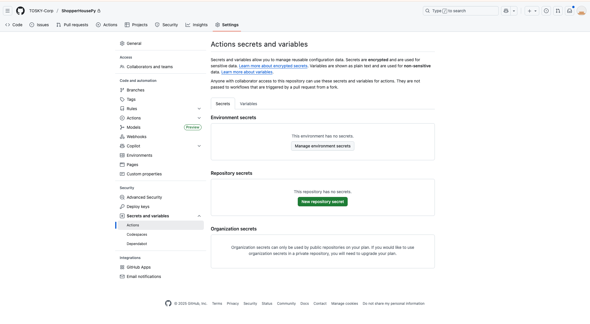
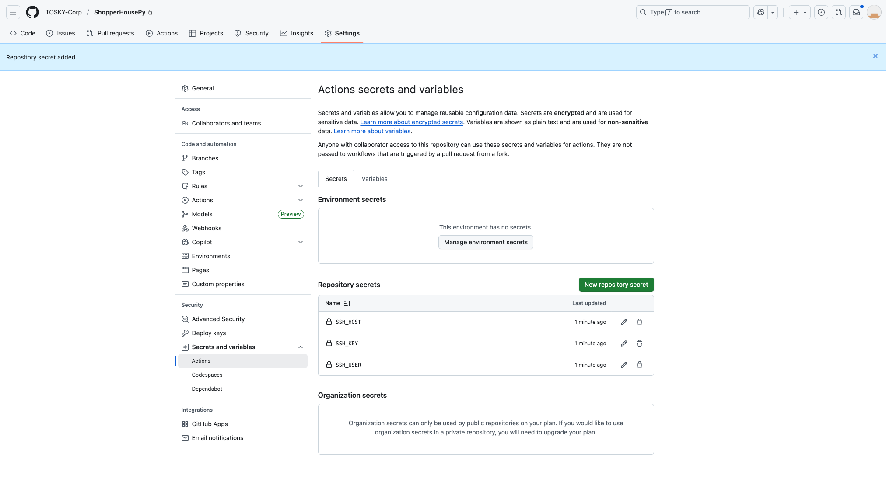

# 🚀 CI/CD Github Action with Python Docker

### 1. Git Repository Setting 설정

Settings → Secrets and variables → Actions → New Repository Secret 클릭



### 2. secret 값 설정

| key      | value                                               |
| -------- | --------------------------------------------------- |
| SSH_HOST | 서버 호스트                                         |
| SSH_KEY  | 비공개키 값(ssh-keygen -t ed25519 으로 생성한 파일) |
| SSH_USER | 리눅스 서버 유저명                                  |



### 3. Github Action yml 파일

프로젝트 루트에 아래와 같은 폴더 구조와 파일을 생성합니다.

- 파일명은 반드시 deploy.yml 일 필요는 없습니다.

```shell
├── .github
│   └── workflows
│       └── deploy.yml
```

yml 파일 내용

```yml
name: Deploy to GCE

on:
  push:
    branches:
      - main # main 브랜치에 push 될 때 실행

jobs:
  deploy:
    runs-on: ubuntu-latest

    steps:
      - name: Checkout repository
        uses: actions/checkout@v4

      - name: Run remote commands via SSH
        uses: appleboy/ssh-action@v1.0.0
        with:
          host: ${{ secrets.SSH_HOST }}
          username: ${{ secrets.SSH_USER }}
          key: ${{ secrets.SSH_KEY }}
          script: |
            cd /app/ShopperHousePy   # ✅ GCE 안의 FastAPI app 폴더
            git pull origin main   # 코드 업데이트
            docker compose -f docker-dev/compose-dev.yml restart
```

```yml
name: Deploy to GCE To DataPy

on:
  push:
    branches:
      - main # main 브랜치에 push 될 때 실행

jobs:
  deploy:
    runs-on: ubuntu-latest

    steps:
      - name: Checkout repository
        uses: actions/checkout@v4

      - name: Run remote commands via SSH
        uses: appleboy/ssh-action@v1.0.0
        with:
          host: ${{ secrets.SSH_HOST }}
          username: ${{ secrets.SSH_USER }}
          key: ${{ secrets.SSH_KEY }}
          script: |
            cd /app/ShopperHouseDataPy   # ✅ GCE 안의 DataPy app 폴더
            git pull origin main   # 코드 업데이트. DataPy 는 상시 떠있는 것이 아니라 docker restart 등은 필요 없음
```

추가적으로 필요에 따라서 docker down 후 up 을 할 수도 있으며, 테스트 코드를 실행하는 step 이
추가될 수도 있습니다.

push 와 merge 는 같습니다.

특정 브랜치에 PR을 하는 경우 PR 하는 브랜치와 pull-request 값을 추가해야 합니다.
