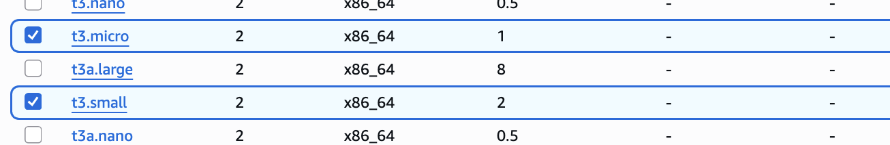

# 🚀 AWS EC2 에 Jenkins 가 너무 느리다(화면 이동 등..)

Jenkins 는 JVM 위에서 동작하고 플러그인도 많아서 메모리를 꽤 많이 필요로 합니다.

---

## AWS ECS Intance 타입 변경하기

AWS 의 t2.micro, t3.micro 같은 1 vCPU / 1GB RAM 인스턴스에서는,
거의 사용이 불가능할 정로도 느립니다.

> 👉 최소 t3.small (2GB RAM), 권장 t3.medium (4GB RAM)

저는 t3.micro 에 Docker 와 docker compose 를 사용하여 Jenkins 를 띄웠는데, 실제로 사용이
불가능할 정도로 느림을 체감하였습니다. 필요한 플러그인도 설치했으니 메모리 사용량은 더 올라갈 수밖에
없었습니다.

```shell
ubuntu@ip-172-31-44-221:~$ free -h
               total        used        free      shared  buff/cache   available
Mem:           914Mi       799Mi        70Mi       2.8Mi       200Mi       114Mi
Swap:             0B          0B          0B
```

- 인스턴스 메모리가 1GB밖에 없음 (914MiB) → Jenkins 자체 실행에 이미 빠듯합니다.
- Jenkins + Java 21 + 플러그인 몇 개만 올려도 메모리 2~3GB는 기본으로 필요합니다.
- Swap 공간도 0B → 메모리가 꽉 차면 곧바로 OOM(Out of Memory) 걸려서 느려지거나 죽습니다.

일단 문제의 상황은 인지하였으니, 인스턴스 타입을 변경해주기로 합니다.

### t3.small 로 타입을 변경혀자

t3.micro → t3.small : RAM 1기가 업그레이드



### 변경해도 느려진다 1

t3.small 로 변경했지만, 여전히 느려서 사용에 불편합니다.
아래의 대응을 바로 진행합니다.

- t3.medium 으로 업그레이드
- 그리고 swap 설정
- JVM 제한
- 그리고 Dockerfile 수정해서, 필요한 플러그인 미리 설치

### Swap 파일 추가 (임시 방편)

메모리 늘리기 전, 지금 바로 느려지는 걸 완화하려면 Swap 추가하세요:

```shell
# 2GB 스왑 파일 생성
sudo fallocate -l 2G /swapfile

# 권한 설정
sudo chmod 600 /swapfile

# 스왑 영역으로 설정
sudo mkswap /swapfile

# 스왑 활성화
sudo swapon /swapfile

# 확인
swapon --show
free -h
```

이렇게 하면 Swap: 2.0G 가 생겨서 OOM은 피할 수 있습니다.
단, 디스크를 스왑으로 쓰는 거라 속도는 여전히 느림 → 장기적으로는 RAM 늘리는 게 답.

---

## 디스크 I/O (EBS 속도) 조정하기

EC2의 루트 볼륨이 gp2 타입(기본 SSD)이고 용량이 작다면, IOPS가 부족해서 Jenkins UI 응답이
느려질 수 있습니다. 👉 gp3 SSD로 바꾸고 IOPS를 조금 올려주면 체감이 확 좋아집니다.

## Docker 환경

- 지금 Jenkins를 Docker로 띄우셨는데, jenkins_home을 EBS와 직접 마운트해서 쓰고 있다면
  I/O 병목이 생길 수 있습니다. Jenkins는 작은 파일을 엄청 많이 쓰는데, 느린 디스크면 웹 UI가
  버벅거립니다.
