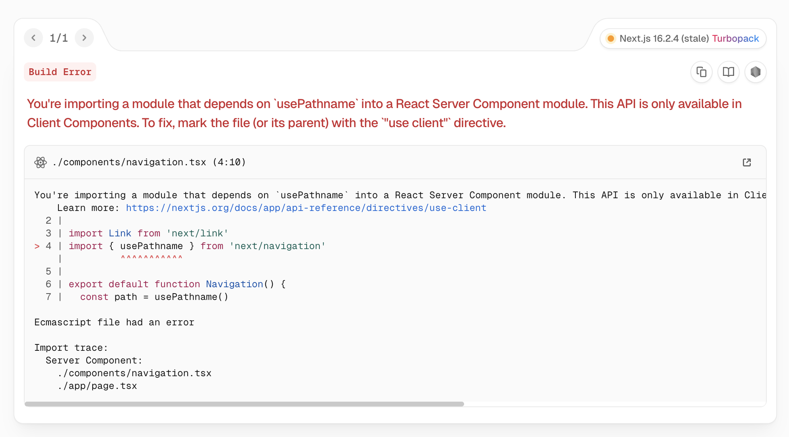

# SSR VS CSR

Next.js 에서 usePathname 을 사용하면 아래와 같은 에러를 볼 수 있다.



에러 내용을 보면, usePathname 은 SSR 에서는 사용할 수 없다는 것이다. 따라서, SSR 과 CSR 이
어떤 것인지, 어떤 차이가 있는지 알아보기로 하자.

---

## Rendering 이란?

- 데이터를 기반으로 화면(UI)을 만들어 브라우저에 표시하는 과정을 의미
- txt 데이터 -> HTML 생성 -> 브라우저 화면 출력
  - 이 과정 전체를 Rendering 이라고 볼 수 있음

---

## CSR (Client Side Rendering)

- CSR 은 브라우저(Client) 측에서 JavaScript 를 실행하여 화면을 렌더링하는 방식이다.
- 대표적으로 React SPA(Single Page Application)가 CSR 방식이다.

### CSR 동작 과정

- 1. 브라우저가 서버에 요청
- 2. 서버는 거의 비어있는 HTML 반환
- 3. 브라우저가 JavaScript 다운로드
- 4. React 실행 5. 화면(Rendering) 생성

### CSR 특징

- 초기 HTML 이 거의 비어있음

예시:

```
html <div id="root"></div>
- 실제 화면은 이후 JavaScript 가 생성한다.
```

- JavaScript 다운로드 전에는 화면이 없음
  - React 는 JavaScript 실행 이후에 화면을 만들기 때문에,
    JavaScript 파일 다운로드 전 → 화면 없음 → 빈 페이지 상태가 발생한다.
  - 즉, JavaScript 의존도가 매우 높다.

### CSR 장점

| 장점                  | 설명                       |
| --------------------- | -------------------------- |
| 빠른 페이지 전환      | 이후 이동은 SPA 방식       |
| 사용자 경험 향상      | 부드러운 인터랙션          |
| 서버 부담 감소        | 서버가 HTML 생성 부담 적음 |
| 프론트 중심 개발 가능 | API 서버와 분리 쉬움       |

### CSR 단점

| 단점                     | 설명                   |
| ------------------------ | ---------------------- |
| 초기 로딩 느림           | JS 다운로드 필요       |
| SEO 취약                 | 초기 HTML 이 비어있음  |
| 저사양 기기 부담         | 브라우저가 렌더링 수행 |
| JS 비활성화 시 동작 불가 | 화면 자체 생성 불가    |

### React 는 기본적으로 CSR

- 기존 React SPA 는 보통 CSR 기반이다.
- 브라우저가 React 를 실행하여 화면을 만든다.

예시:

```
ReactDOM.createRoot(document.getElementById('root')) .render(<App />)
```

---

### SSR (Server Side Rendering)

- SSR 은 서버에서 HTML 을 미리 생성하여 브라우저에 전달하는 방식이다.
- 대표적으로 Next.js App Router 가 SSR 기반 구조를 가진다.

### SSR 동작 과정

- 1. 브라우저 요청
- 2. 서버에서 React 실행
- 3. 서버가 HTML 생성
- 4. 완성된 HTML 반환
- 5. 브라우저가 즉시 화면 출력
- 6. 이후 JavaScript hydration 수행

### SSR 특징

#### 서버에서 HTML 을 미리 생성

- 브라우저는 완성된 HTML 을 바로 받는다.

예시:

```
html <h1>Hello Next.js</h1>
따라서, JavaScript 다운로드 이전에도 이미 화면이 존재
```

### SEO(Search Engine Optimization)에 유리

- 검색 엔진 크롤러는 HTML 을 읽는다.
- CSR 은 초기 HTML 이 비어있을 수 있지만, SSR 은 이미 내용이 포함되어 있다.
- 따라서 검색 엔진이 페이지 내용을 쉽게 분석할 수 있다.

```
html <div id="root"></div>

VS

html <h1>상품 상세 페이지</h1>
```

### JavaScript 가 비활성화 되어도 HTML 존재

- SSR 은 서버에서 HTML 을 생성하기 때문에,
  - JavaScript OFF → HTML 자체는 존재 → 최소한의 콘텐츠 확인 가능 상태가 된다
- 물론 React 인터랙션은 동작하지 않을 수 있다.

### Next.js 는 기본적으로 SSR 기반

특히 App Router 에서는:

- React Server Component
- Streaming
- Suspense
- Partial Rendering

기반 구조를 사용한다.

즉:

Next.js = 기본적으로 서버 중심 렌더링 구조라고 볼 수 있다.

---

## React 와 Next.js 의 가장 큰 차이

| React SPA         | Next.js          |
| ----------------- | ---------------- |
| CSR 중심          | SSR 중심         |
| 브라우저 렌더링   | 서버 렌더링      |
| SEO 약함          | SEO 강함         |
| 초기 빈 HTML 가능 | 초기 HTML 존재   |
| 직접 라우팅 구성  | 파일 기반 라우팅 |
