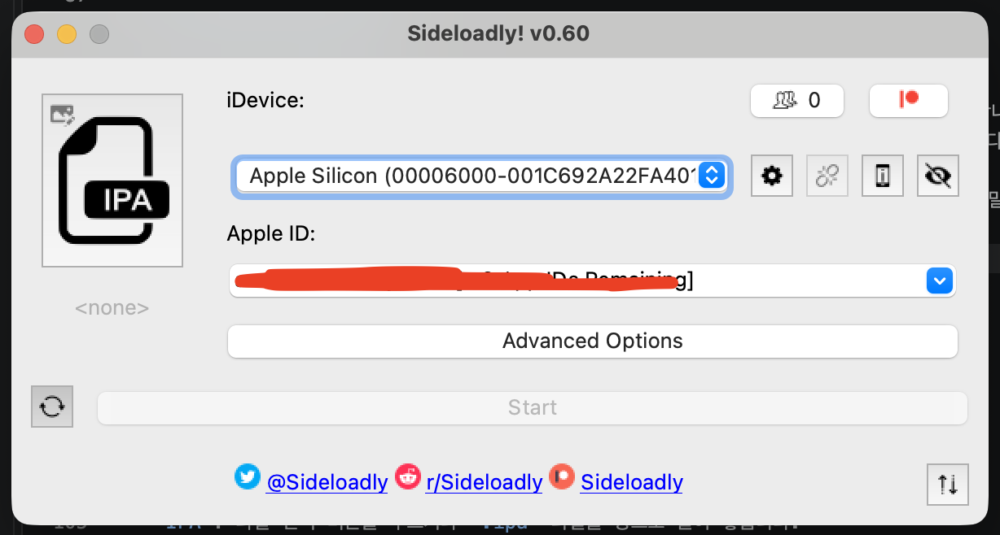

# Sideloadly를 활용하여 iOS 기기에 앱 설치하기

## 목적과 범위

Sideloadly는 Mac에서 `.ipa` 파일에 Apple ID 기반 서명을 적용한 뒤, 연결된 Apple 기기에 설치하는
도구입니다. App Store 또는 TestFlight로 배포할 수 없는 개발·테스트용 앱을 개인 기기에서 확인할 때
사용할 수 있습니다.

- 이 문서는 본인이 개발했거나 설치 권한을 보유한 `.ipa`를 실기기에 설치하는 절차를 설명합니다.
- 출처와 권한을 확인할 수 없는 `.ipa`에는 악성 코드가 포함될 수 있으므로 설치하지 않습니다.
- 일반 사용자 배포는 App Store 또는 TestFlight 같은 Apple의 공식 배포 방식을 우선 사용합니다.

## 먼저 알아둘 제한 사항

Sideloadly 공식 안내를 2026-09-16에 확인했습니다. 무료 Apple ID도 사용할 수 있지만, 무료 계정으로
서명한 앱은 최대 7일 동안만 실행할 수 있습니다. 유료 Apple Developer Program 계정으로 서명한 앱은
최대 1년 동안 실행할 수 있습니다.

> 무료 Apple ID: 기본적으로 Apple 계정 생성에는 비용이 들지 않습니다.

무료 Apple ID는 iOS 10 이상 기기에서 동시에 설치할 수 있는 Sideloadly 앱 수가 3개로 제한될 수 있습니다.

Apple 정책과 Sideloadly 동작은 변경될 수 있으므로, 설치 전에 아래의 문서를 다시 확인합니다.

- [Sideloadly 공식 웹사이트](https://Sideloadly.io/)
- [FAQ](https://Sideloadly.io/faq)

> 주의: 회사 Apple ID, 공유 Apple ID, 인증서 비밀번호를 개인 설치 용도로 입력하지
> 않습니다. Sideloadly는 Apple ID 인증을 요구할 수 있으므로, 조직의 보안 정책을
> 확인하고 개인 테스트 전용 Apple ID 사용을 검토합니다.

## 준비물

- macOS 10.12 Sierra 이상이 설치된 Mac
- USB 케이블과 설치 대상 iPhone 또는 iPad
- 설치 권한이 있는 `.ipa` 파일
- 앱 서명에 사용할 Apple ID
- iPhone 또는 iPad의 잠금 해제 비밀번호
- 인터넷 연결

> Sideloadly는 Apple Silicon Mac도 지원합니다. 처음 설치할 때는 USB 연결을 권장합니다.

> Wi-Fi 설치와 자동 갱신은 기기를 Mac에 한 번 연결해 신뢰 처리한 뒤에 설정합니다.

## 설치 전 확인

### `.ipa` 파일의 출처 확인

`.ipa`는 iOS 앱 패키지 파일입니다. 설치 전 다음을 확인합니다.

- 사내 빌드 시스템, 개발 담당자, 신뢰할 수 있는 배포 위치에서 받은 파일인지 확인합니다.
- 앱 이름, 버전, 대상 iOS 버전, Bundle Identifier를 배포 담당자에게 확인합니다.
- 기존 앱을 덮어쓸 계획이라면, 기존 앱의 데이터가 백업 또는 서버 동기화되어 있는지 확인합니다.
- App Store에서 내려받은 앱을 임의로 추출한 파일이나 출처를 알 수 없는 파일은 설치하지 않습니다.

### 기기와 Mac 신뢰 처리

- iPhone 또는 iPad를 USB 케이블로 Mac에 연결합니다.
- 기기에 `이 컴퓨터를 신뢰하겠습니까?` 메시지가 나타나면 `신뢰`를 누릅니다.
- 기기 암호를 입력합니다.
- Mac에서 Finder를 열고 사이드바의 `위치` 아래에 연결한 기기가 보이는지 확인합니다.

기기가 보이지 않으면 케이블 또는 USB 포트를 바꾸고, 기기 화면을 잠금 해제한 뒤 다시 연결합니다.

### Developer Mode 확인

iOS 16 이상에서는 Sideloadly 앱 설치 또는 실행 시 Developer Mode가 필요할 수 있습니다.
기기에서 다음 경로를 확인합니다.

- `설정` → `개인정보 보호 및 보안`
- 화면 아래쪽의 `개발자 모드`
- 스위치를 켠 뒤, 안내에 따라 기기를 재시동하고 다시 확인

회사에서 관리하는 기기에서는 MDM 정책 때문에 Developer Mode를 켤 수 없을 수 있습니다.
이 경우 기기 관리자에게 허용 여부를 확인합니다.

## Sideloadly 설치

### 공식 사이트에서 내려받기

- Mac의 브라우저에서 [Sideloadly 공식 웹사이트](https://Sideloadly.io/)를 엽니다.
- `Download for macOS`를 선택해 설치 파일을 내려받습니다.
- 내려받은 DMG 또는 설치 파일을 열고, 화면 안내에 따라 Sideloadly를 `응용 프로그램` 폴더에 설치합니다.

검색 광고나 제3자 다운로드 사이트가 아닌 공식 사이트를 사용합니다. 설치 파일의 해시값 또는 서명 정보를 별도로
제공받았다면 배포 담당자가 제공한 값과 비교합니다.

### macOS에서 처음 실행하기

- `응용 프로그램` 폴더에서 Sideloadly를 실행합니다.
- macOS가 개발자를 확인할 수 없다는 경고를 표시하면, 파일의 출처가 공식 사이트인지 다시 확인합니다.
- 출처가 확인된 경우에만 `시스템 설정` → `개인정보 보호 및 보안`에서 `그래도 열기`를 선택합니다.

경고를 우회하기 전에 설치 파일이 변조되지 않았는지 확인해야 합니다. 출처가 불명확한 파일은 열지 말고 삭제합니다.

> 

 

## iPhone 또는 iPad에 앱 설치

### Sideloadly 화면에서 항목 입력

Sideloadly를 열면 다음 항목을 순서대로 설정합니다.

- `iDevice`: USB로 연결한 iPhone 또는 iPad를 선택합니다.
- `IPA`: 파일 선택 버튼을 누르거나 `.ipa` 파일을 창으로 끌어 놓습니다.
- `Apple ID`: 앱 서명에 사용할 Apple ID를 입력합니다.
- 설치 방식: 처음에는 기본값인 `Apple ID Sideloadly`를 유지합니다.

`Advanced Options`는 앱 이름, Bundle Identifier, 플러그인 등을 바꾸는 고급 기능입니다.
처음 설치할 때는 기본값을 유지합니다. Bundle Identifier를 바꾸면 기존 앱을 업데이트로
인식하지 못하거나 앱 데이터가 분리될 수 있습니다.

### 설치 시작

- 입력한 기기, `.ipa` 파일, Apple ID가 맞는지 다시 확인합니다.
- `Start` 버튼을 누릅니다.
- Apple ID 인증이 필요하면 화면 안내에 따라 인증을 완료합니다.
- Sideloadly 하단 로그에서 서명과 설치 진행 상태를 확인합니다.
- 성공 메시지가 표시될 때까지 케이블을 분리하거나 Mac을 잠자기 상태로 전환하지 않습니다.

### iPhone 또는 iPad에서 개발자 신뢰

설치가 끝나도 앱을 처음 실행할 때 `신뢰할 수 없는 개발자` 메시지가 표시될 수 있습니다.
이 경우 기기에서 다음을 수행합니다.

- `설정` → `일반` → `VPN 및 기기 관리`로 이동합니다.
- `개발자 앱` 아래에서 설치에 사용한 Apple ID를 선택합니다.
- `신뢰`를 누르고 확인 창에서 다시 `신뢰`를 누릅니다.
- 홈 화면으로 돌아가 설치한 앱을 실행합니다.

iOS 버전에 따라 메뉴 이름이 `기기 관리` 또는 `프로파일 및 기기 관리`로 다르게 표시될 수 있습니다.
해당 항목이 보이지 않으면 앱 설치가 완료됐는지 먼저 확인합니다.

## 설치 후 확인

- 홈 화면 또는 앱 보관함에서 앱 아이콘이 생성됐는지 확인합니다.
- 앱을 실행해 시작 화면이 정상적으로 나타나는지 확인합니다.
- 로그인, 네트워크 호출, 푸시 알림처럼 앱이 사용하는 핵심 기능을 테스트합니다.
- 테스트가 끝나면 앱을 길게 눌러 삭제하거나, 동일한 Apple ID와 Bundle Identifier로 새 `.ipa`를
  설치해 업데이트합니다.

앱을 덮어쓸 때 Apple ID와 Bundle Identifier가 달라지면 별도 앱으로 설치될 수 있습니다.
업데이트 전에 앱 데이터 보존 방식과 배포 담당자의 안내를 확인합니다.

## 자주 발생하는 문제

### 기기가 Sideloadly에 표시되지 않습니다

- iPhone 또는 iPad의 잠금을 해제하고 `이 컴퓨터를 신뢰`했는지 확인합니다.
- Finder에서 기기가 보이는지 확인합니다.
- 다른 USB 케이블이나 포트로 바꾸고 다시 연결합니다.
- Mac과 iPhone 또는 iPad를 재시동한 뒤 다시 시도합니다.

### `신뢰할 수 없는 개발자` 메시지가 나타납니다

앞에서 설명한 `설정` → `일반` → `VPN 및 기기 관리`에서 설치에 사용한 Apple ID를
신뢰합니다. 네트워크 연결이 필요한 경우도 있으므로 Wi-Fi 또는 모바일 데이터를 연결한 상태에서 다시 시도합니다.

### 앱이 설치됐지만 실행되지 않습니다

- Developer Mode가 필요한지 확인합니다.
- 무료 Apple ID로 설치한 앱의 7일 유효 기간이 지났는지 확인합니다.
- `.ipa`가 현재 기기 모델, iOS 버전, CPU 아키텍처를 지원하는지 배포 담당자에게 확인합니다.
- 설치 로그에서 오류 문구를 확인하되, Apple ID와 기기 식별 정보는 가린 뒤 공유합니다.

기기 호환성 오류를 해결하려고 `Remove limitation on supported devices` 같은 고급
옵션을 무조건 켜면 앱이 실행 중 충돌할 수 있습니다. 호환되는 `.ipa`를 받는 것이 우선입니다.

### 무료 계정의 앱 수 또는 App ID 한도 오류가 나타납니다

- 무료 Apple ID는 설치 가능한 Sideloadly 앱 수와 일정 기간에 만들 수 있는 App ID 수에 제한이 있습니다.
- 불필요한 테스트 앱을 삭제하고, Sideloadly 공식 FAQ의 제한 및 대기 안내를 확인합니다.
- 제한을 우회하는 도구나 설정 변경은 사용하지 않습니다.

## 참고 자료

- [Sideloadly 공식 웹사이트](https://Sideloadly.io/)
- [Sideloadly 공식 FAQ](https://Sideloadly.io/faq)
- [Apple Developer: 등록된 기기에 앱 배포하기](https://developer.apple.com/documentation/xcode/distributing-your-app-to-registered-devices)
