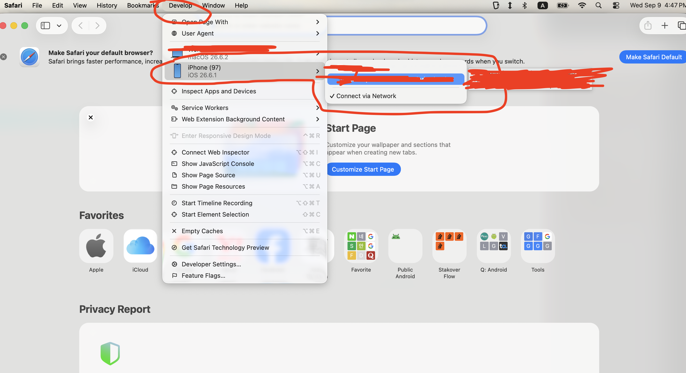
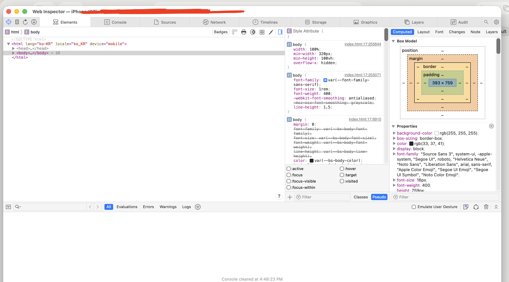

# 🚀 iOS 웹뷰 디버깅 방법

- 1. iPhone에서 앱을 실행합니다.
- 2. 앱 안의 WebView가 로그인 화면까지 로딩된 상태로 둡니다.
- 3. Mac에서 Safari를 엽니다.
- 4. 상단 메뉴에서 개발자 또는 Develop 메뉴를 클릭합니다.
- 5. 연결된 iPhone 이름을 선택합니다.
- 6. 하위 목록에서 앱의 WebView 항목을 선택합니다.

## Safari 브라우저

상단 메뉴에서 Develop 선택 > 연결된 기기 선택 > 앱 선택

## 디버깅

