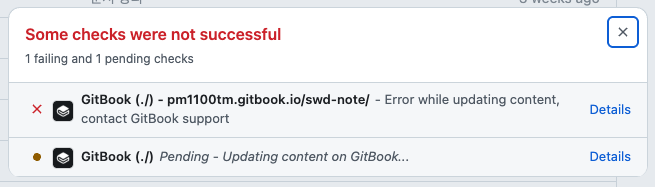
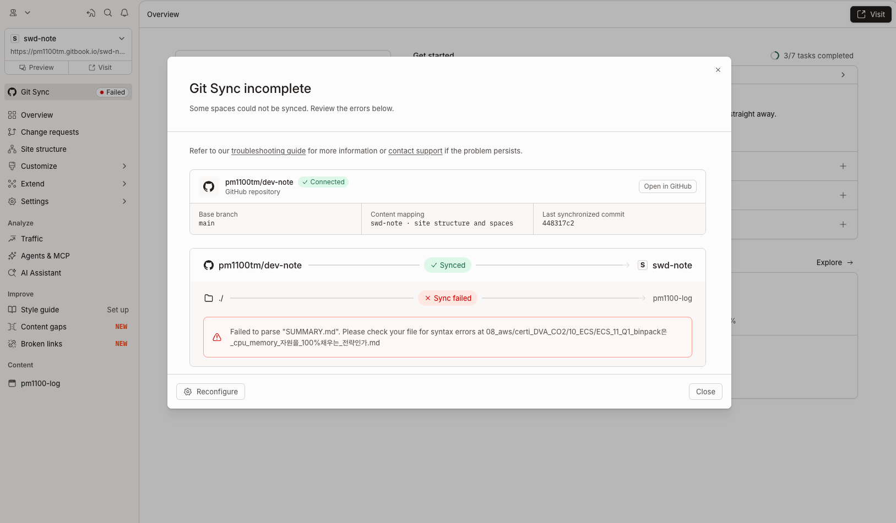

# Main 브랜치에 푸쉬 했을 때 연동 실패

깃북 싱크 실패가 발생할 수 있습니다.



다양한 이유가 있을 수 있는데, 그럴 때 아래와 같이 깃북에서 실패 로그를 확인할 수 있습니다.



조사해보니 이 경우는, SUMMURY.md 에 특수문자 `%`가 원인이었습니다.

## 원인

원인은 `SUMMARY.md` 링크 경로의 `%` 문자였습니다.

URL에서 `%`는 이스케이프 시작 문자이므로, 해당 문구를 GitBook이 잘못된 URL로 해석했습니다.

`%`를 `%25`로 인코딩해 수정하면 해결됩니다.

```shell
# 수정 전
- [binpack은 EC2의 CPU·메모리를 100%까지 채우는 전략인가요?](<08_aws/certi_DVA_CO2/10_ECS/ECS_11_Q1_binpack은_cpu_memory_자원을_100%채우는_전략인가.md>)

# 수정 후
- [binpack은 EC2의 CPU·메모리를 100%까지 채우는 전략인가요?](<08_aws/certi_DVA_CO2/10_ECS/ECS_11_Q1_binpack은_cpu_memory_자원을_100%25채우는_전략인가.md>)

# 100% -> 100%25 로 변경
```
