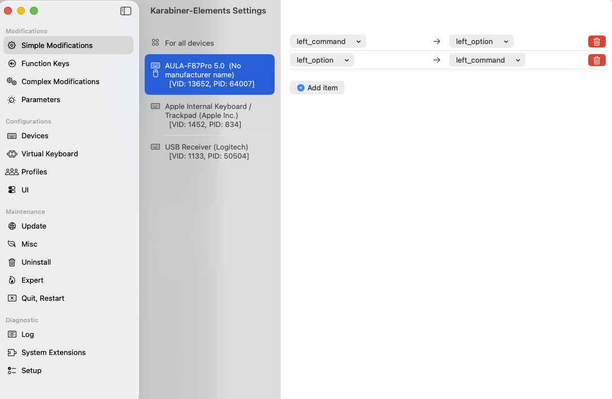

# 키보드 with Karabiner element 설정

```
FN 1 또는 2 또는 3을 길게 눌러 블루투스 인식되도록

⬇

블루투스에서 키보드 활성화(현재 AULA F8Pro 5.0 - 독거미)

⬇

Karabiner Simple Modifications

⬇

left command -> left option
left option -> left command
```


