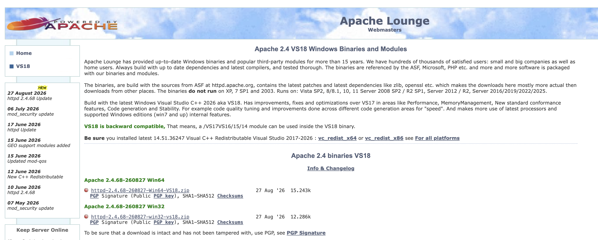

# 아파치 설치하여 로컬 컴퓨터에서 정적 페이지 띄우기

## 아파치란?

- 아파치 소프트웨어 재단에서 관리하는 무료 오픈 소스 웹 서버 소프트웨어입니다.
- 클라이언트(웹 브라우저)가 요청한 HTML, 이미지 등 정적 콘텐츠를 전달하는 역할을 합니다.

## 주요 특징

- 크로스 플랫폼
  - 리눅스, 유닉스, 윈도우 등 다양한 운영체제에서 작동합니다.
- 모듈형 구조
  - 필요한 기능을 모듈 형태로 쉽게 추가하거나 제거할 수 있습니다.
- 높은 호환성
  - 오랜 역사 동안 검증되어 안정적이며 다양한 웹 기술과 잘 연동됩니다.

## 주요 기능 및 용도

- 정적 데이터 처리
  - 웹페이지의 기본 텍스트, 이미지, 스타일시트(CSS) 등을 사용자에게 전송합니다.
- 가상 호스팅
  - **하나의 서버에서 여러 개의 웹사이트를 독립적으로 운영할 수 있게 지원합니다.**
- 보안 및 인증
  - 접근 제어와 SSL/TLS 인증서를 통한 보안 통신을 설정할 수 있습니다.

---

<br>

## 실습(Window 기준)

### 1. 다운로드

- https://www.apachelounge.com/download/



위 페이지에서 Window 기기의 Bit에 맞는 버전 다운로드

### 2. 압축 풀기 및 설치

- 압축 해제
- 압축 안의 Apache24 폴더를 그대로 C:\Apache24 폴더로 이동 (\*폴더가 없으면 생성)

최종적으로 아래 파일이 있어야 합니다.

```shell
C:\Apache24\bin\httpd.exe
C:\Apache24\conf\httpd.conf
```

### 3. 정적 페이지를 띄울 폴더 및 파일 생성

```shell
D:\Mobile
D:\Mobile\index.html
D:\Mobile\css
D:\Mobile\js
D:\Mobile\assets
```

중요한 점은 `D:\Mobile\01_install_page\index.html` 구조가 아니라, 브라우저 루트에서 바로
보일 index.html이 D:\Mobile\index.html에 있어야 한다는 것입니다.

### 4. 아파치 설정 변경

관리자 권한 메모장 또는 VS Code로 아래 파일을 엽니다.

```shell
C:\Apache24\conf\httpd.conf
```

다음 항목을 찾아 수정합니다.

```
ServerRoot "c:/Apache24"
```

- 없거나 경로가 다르면 위처럼 맞춥니다.
- Listen은 기본적으로 80이면 됩니다.

```shell
Listen 80
```

ServerName이 주석 처리되어 있으면 아래처럼 추가하거나 수정합니다.

```shell
ServerName localhost:80
```

기존 DocumentRoot와 <Directory> 설정을 찾습니다.

```shell
# 기존 예:
DocumentRoot "${SRVROOT}/htdocs"
<Directory "${SRVROOT}/htdocs">


# 아래처럼 변경합니다.
DocumentRoot "D:/Mobile"

<Directory "D:/Mobile">
  Options Indexes FollowSymLinks
  AllowOverride None
  Require all granted
</Directory>

# DirectoryIndex 설정도 확인합니다.
DirectoryIndex index.html


# 보안상 운영에 가까운 설정으로 가려면 Indexes는 빼는 것이 낫습니다.
<Directory "D:/Mobile">
  Options FollowSymLinks
  AllowOverride None
  Require all granted
</Directory>

# 정적 페이지라면 이 설정이면 충분합니다.
```

### 5. Apache 설정 검사

관리자 권한 PowerShell 또는 CMD를 열고 실행합니다.

```shell
cd C:\Apache24\bin

# 문법 검사
httpd.exe -t

# 정상이면 다음처럼 나옵니다.
Syntax OK

# 오류가 나오면 대부분 경로 오타, 따옴표 누락, D:\Mobile 폴더 없음 문제입니다.
```

### 6. Apache 실행 테스트

콘솔에서 임시 실행:

```shell
cd C:\Apache24\bin
httpd.exe
```

- 이 상태에서 창이 멈춰 있으면 Apache가 실행 중인 것입니다. 브라우저에서 확인하세요.
- 브라우저에서 접속합니다.
  - http://localhost/
  - http://127.0.0.1/
- D:\Mobile\index.html 화면이 보이면 성공입니다.

#### 오류 확인

```shell
# 관리자 CMD에서,

#  80 포트 충돌 확인
netstat -ano | findstr :80

# 예를 들어 이런 식으로 나오면 이미 80 포트를 누가 쓰고 있는 것입니다.
TCP    0.0.0.0:80    0.0.0.0:0    LISTENING    1234

# PID 확인
tasklist /FI "PID eq 1234"

# IIS, nginx, 다른 Apache, Docker, Skype류가 80을 잡고 있을 수 있습니다.
# 임시로 Apache 포트를 8080으로 바꿔도 됩니다.
C:\Apache24\conf\httpd.conf:

Listen 8080
ServerName localhost:8080

# 변경 후
cd C:\Apache24\bin
httpd.exe -t
httpd.exe
```

### 7. Apache를 Windows 서비스로 등록

관리자 권한 PowerShell 또는 CMD에서 실행합니다.

```shell
cd C:\Apache24\bin

# 아파치 설정 문법 검사
httpd.exe -t

# 서비스 설치/설치 제거
httpd.exe -k install
httpd.exe -k uninstall

# 서비스 시작/재시작/중지
httpd.exe -k start
httpd.exe -k restart
httpd.exe -k stop
```

- Windows 서비스 목록에서는 보통 Apache2.4 이름으로 보입니다.
- 문제가 생기면 먼저 확인할 파일은 아래입니다.
  - C:\Apache24\logs\error.log
  - C:\Apache24\conf\httpd.conf
  - D:\Mobile\index.html

#### 서비스 등록 시 에러 발생

```shell
# 서비스 제거 후 재등록
cd C:\Apache24\bin
httpd.exe -k stop
httpd.exe -k uninstall

# 그 다음 서비스가 남아있는지 확인:
sc query Apache2.4

# 아직 남아 있으면 삭제:
sc delete Apache2.4

# 삭제 후 CMD 창을 닫고, 관리자 권한 CMD를 새로 여세요.
# 다시 등록:
cd C:\Apache24\bin
httpd.exe -k install

# 확인:
sc qc Apache2.4

# 그리고 시작:
httpd.exe -k start

# 그래도 실패하면 서비스 실행 계정 변경
# Windows 서비스 관리자를 엽니다.

services.msc

# Apache2.4 찾기 → 우클릭 → 속성 → 로그온 탭.
# 기본값은 보통 로컬 시스템 계정입니다. 일단 이걸 권장합니다.
# 로컬 시스템 계정 선택
# 적용 후 다시 시작하세요.
cd C:\Apache24\bin
httpd.exe -k start


# Apache 서비스 전용 디버그 실행
# 서비스 모드에서 어떤 문제가 나는지 직접 확인하려면 아래를 실행합니다.
# 이 명령에서 출력되는 에러가 서비스 시작 실패의 실제 원인입니다.
cd C:\Apache24\bin
httpd.exe -k runservice


# 이벤트 뷰어 확인
# 서비스 시작 실패는 Apache 로그보다 Windows 이벤트 로그에 더 자세히 남는 경우가 있습니다.
이벤트 뷰어
→ Windows 로그
→ 응용 프로그램

또는

Windows 로그
→ 시스템

# 소스가 아래 중 하나인 항목을 확인하세요.
Apache Service
Apache2.4
Service Control Manager
```

### 8. 방화벽 확인

- 로컬 테스트만 할 거면 방화벽을 열 필요는 없습니다.
- 같은 네트워크의 다른 기기에서도 접속하려면 Windows Defender 방화벽에서 TCP 80 인바운드를
  허용해야 합니다.
- 하지만 ngrok만 사용할 목적이면 보통 로컬 Apache가 localhost:80에서 뜨기만 하면 됩니다.

### 9. ngrok 설치

권장 설치 방식은 Microsoft Store 또는 winget입니다.

```shell
# PowerShell에서:
winget install ngrok -s msstore

# 설치 확인:
ngrok version

# ngrok 계정에서 authtoken을 확인한 뒤 등록합니다.
ngrok config add-authtoken YOUR_NGROK_AUTHTOKEN

# ngrok으로 HTTPS 임시 도메인 연결
# Apache가 80번 포트에서 정상 동작 중인 상태에서 실행합니다.
ngrok http 80
```

<br>

---

## 실습(Mac 기준)

### 1. Homebrew로 아파치 설치하기

```shell
brew install httpd
```

### 2. 아파치 기본 명령어

아파치 서버를 관리할 때 사용하는 기본 명령어입니다.

```shell
brew install httpd
```

### 3. 설정 파일 수정하기

```shell
# 실행/종료/재시작 with brew
brew services start httpd
brew services stop httpd
brew services restart httpd

# 실행/종료/재시작 with apachectl
apachectl start
apachectl stop
apachectl restart

# 설정 파일 수정하기
# 아파치의 설정 파일 httpd.conf 를 수정하여 포트나 기본 경로 변경
vim /opt/homebrew/etc/httpd/httpd.conf

# 설정을 변경한 뒤에는 아파치 서버를 재시작해야 적용됩니다
```

---

<br>

## QA

## Q1. Nginx의 차이점

- [Apache 와 Nginx 의 차이점](./etc024_apache_nginx_차이점.md)

## Q2. 톰캣(Tomcat)과의 관계

## Q3. 가상 호스트(Virtual Host)
