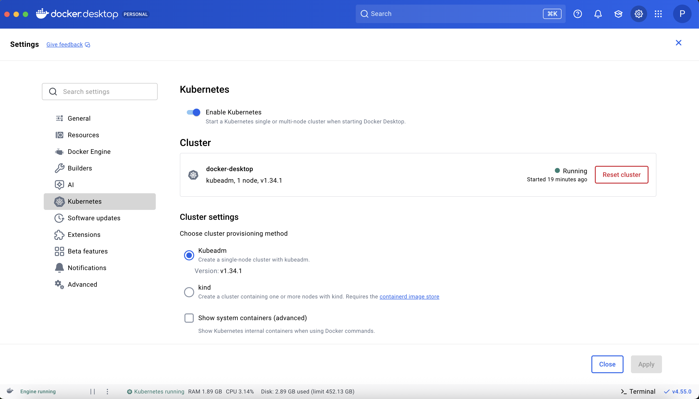
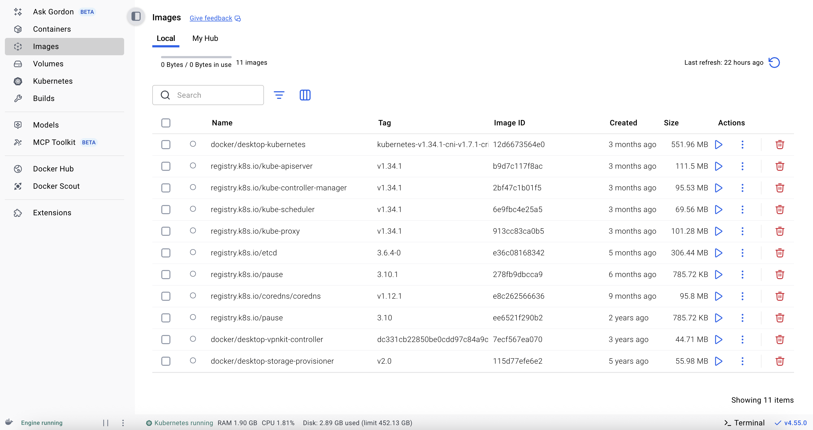

# 🚀 Docker Desktop Kubernetes 설정

```shell
# Docker Desktop 설치. 시간이 좀 걸림
Settings > Kubernetes > Enable Kubernetes
```

\| 설치 완료된 화면

 

설치 확인

```shell
kubectl version --client
kubectl cluster-info
kubectl get nodes
```
