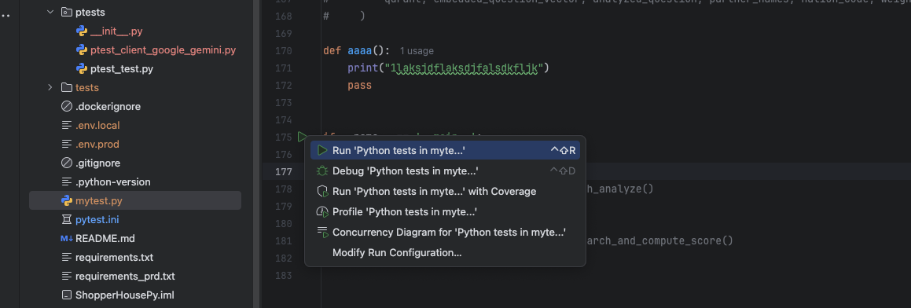
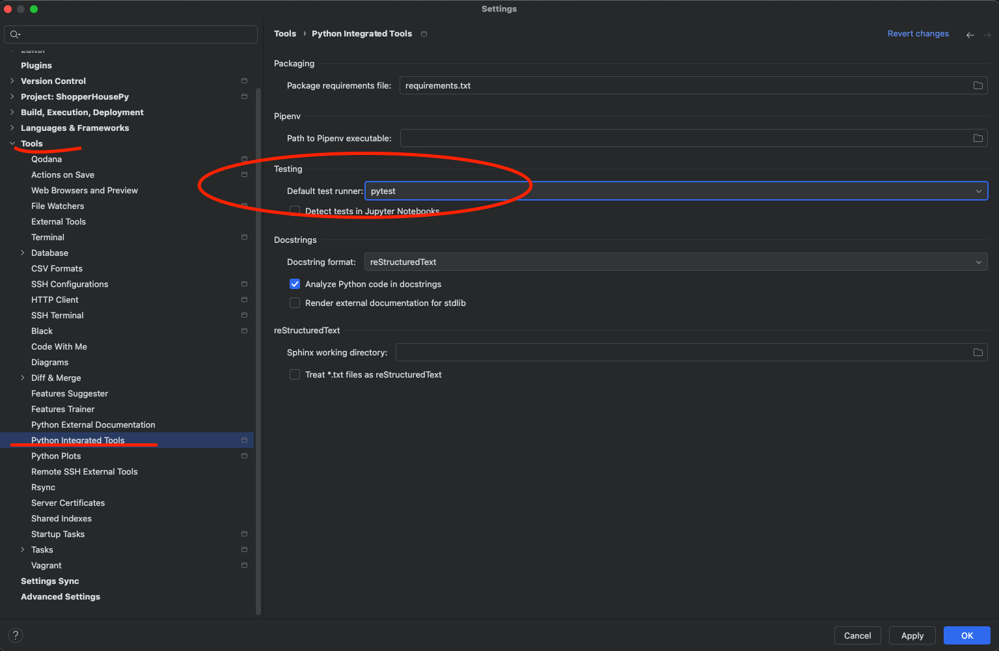

# 🚀 PyCharm pytest 설정

Pytest 설치 후 Pycharm 에서 각 메서드에 실행 버튼으로 실행하고 싶을 때, 자꾸 Pytest 로 실행되는 이슈가 발생한다.

## 해결 방법

이럴 때 아래의 경로에서 Testing 실행 방법을 변경해서 실행할 수 있다.

> 이미지 상으로는 pytest 를 선택하였지만, Unittests 로 변경해야 예상한대로 작동한다.

