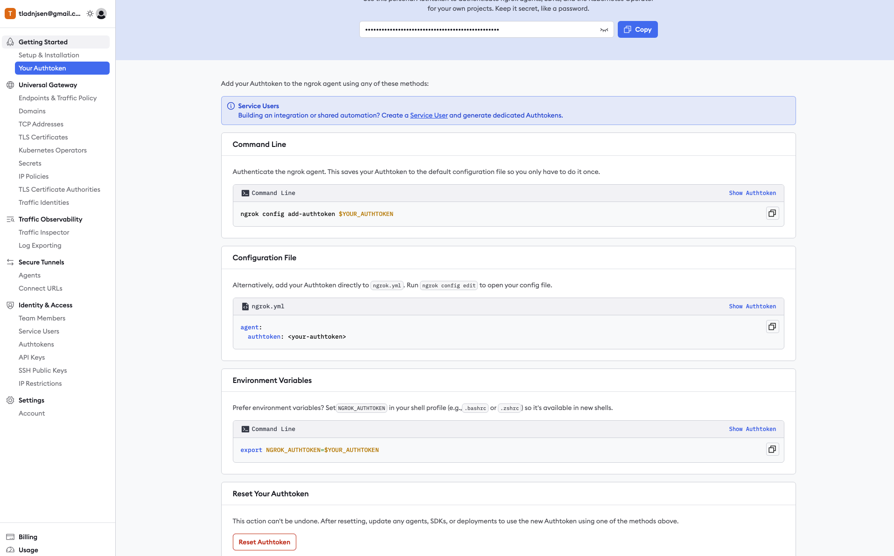

# 🚀 ngrok 이란?

- 로컬 서버 → 외부 공개
  - 예를 들어 localhost:8080 에서 API 서버를 돌리고 있다면, ngrok이 인터넷에서 접근 가능한
    임시 URL(예: https://abcd1234.ngrok.io)을 발급해 줍니다.
  - 이 주소를 통해 다른 사람도 내 로컬 서버에 접속할 수 있게 됩니다.
- 보안 터널링
  - ngrok은 HTTPS 보안 연결을 자동으로 제공합니다.
  - 방화벽/공인 IP 설정 없이도 안전하게 외부와 통신할 수 있습니다.
- 개발 편의성
  - Webhook 테스트 (예: 카카오, 네이버, 슬랙, 페이먼트 API 등 외부 서비스 콜백)
  - 모바일 기기에서 로컬 서버 접속 테스트
  - 시연/데모 환경 공유

## 사용해야 하는 예시 상황

Github Repository 에 setting webhook 으로 들어갈 주소를 등록해줘야 합니다.
이 때 localhost 또는 퍼블릭 IP + port 를 등록해도, 로컬 젠킨스 컨테이너를 찾을 수 없으므로
ngrok 라는 것을 사용하여 외부 IP를 임시로 생성하여 등록합니다.

---

### 🧐 사용법

맥북을 기준으로 합니다.

### [1.] 설치

```shell
brew install --cask ngrok


# 설치 완료 확인
...
==> Downloading https://raw.githubusercontent.com/Homebrew/homebrew-cask/653b05c7bf913584522f3227461d711194e97616/Casks/n/ngrok.rb
######################################################################################################################################## 100.0%
==> Downloading https://bin.equinox.io/a/jrWErVRJLWS/ngrok-v3-3.28.0-darwin-arm64.zip
######################################################################################################################################## 100.0%
==> Installing Cask ngrok
==> Linking Binary 'ngrok' to '/opt/homebrew/bin/ngrok'
🍺  ngrok was successfully installed!
==> No outdated dependents to upgrade!
```

### [2.] ngrok 가입

👉 [ngrok 가입하기](https://dashboard.ngrok.com/get-started/your-authtoken)

- 가입 후 발급받은 auth 토큰 복사 및 보관 후, 아래의 커맨드 실행합니다.
- auth token 은 폐기 후 다시 생성할 수 있습니다.



```shell
ngrok config add-authtoken {your-auth-token}


# ngrok.yml 파일 정상 생성 확인
╰─ ngrok config add-authtoken 20wn-------------
Authtoken saved to configuration file: /Users/swd/Library/Application Support/ngrok/ngrok.yml
```

### [3.] ngrok 사용하여 외부 IP 만들기

- 예를 들어, localhost:8080 에 대한 외부 IP를 생성합니다.
- 유효 기간은 약 1시간 정도

```shell
ngrok http 8080


# 외부 IP 정상 생성 확인. Forwarding 을 보면 https 로 생성된 것 확인할 수 있다
ngrok                                                                                                                          (Ctrl+C to quit)

🧠 Call internal services from your gateway: https://ngrok.com/r/http-request

Session Status                online
Account                       <your-ngrok-account>@gmail.com (Plan: Free)
Version                       3.28.0
Region                        Japan (jp)
Web Interface                 http://127.0.0.1:4040
Forwarding                    https://0b24d54859ac.ngrok-free.app -> http://localhost:9081

Connections                   ttl     opn     rt1     rt5     p50     p90
                              0       0       0.00    0.00    0.00    0.00
```

위에서 생성된 외부 IP를 사용할 곳에 등록합니다.

- 예: Github Repository Webhook
