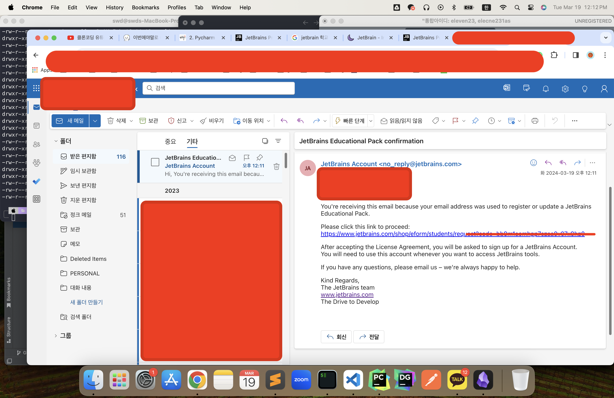
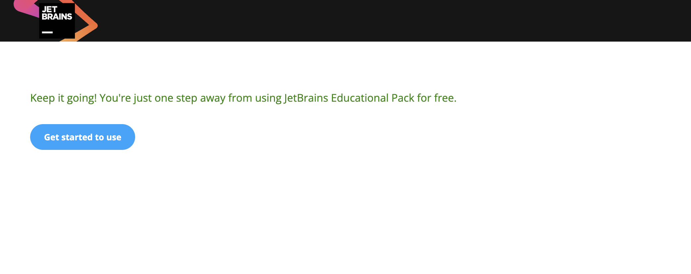
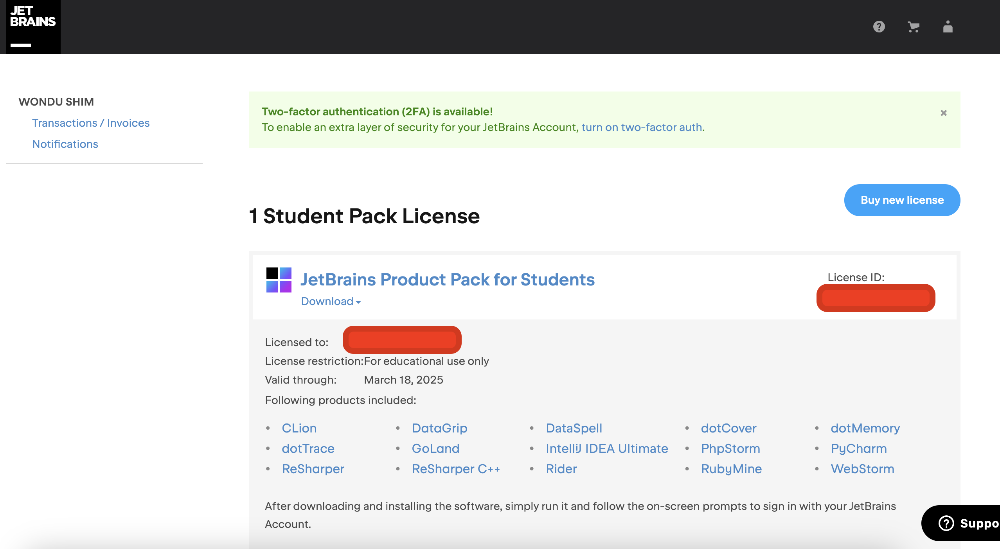

# 019\_jetbrain\_license

* [JetBrain Education 사이트 접속](https://www.jetbrains.com/community/education/#students)
* 하단의 apply now 클릭
* 서식에서 입력 값 선택 및 입력 (이메일에 학교 계정 입력)
* 학교 계정에서 이메일 확인
  * 
* 링크 클릭
  * 
* JetBrain 로그인하고 라이센스 연장 확인
  * 
