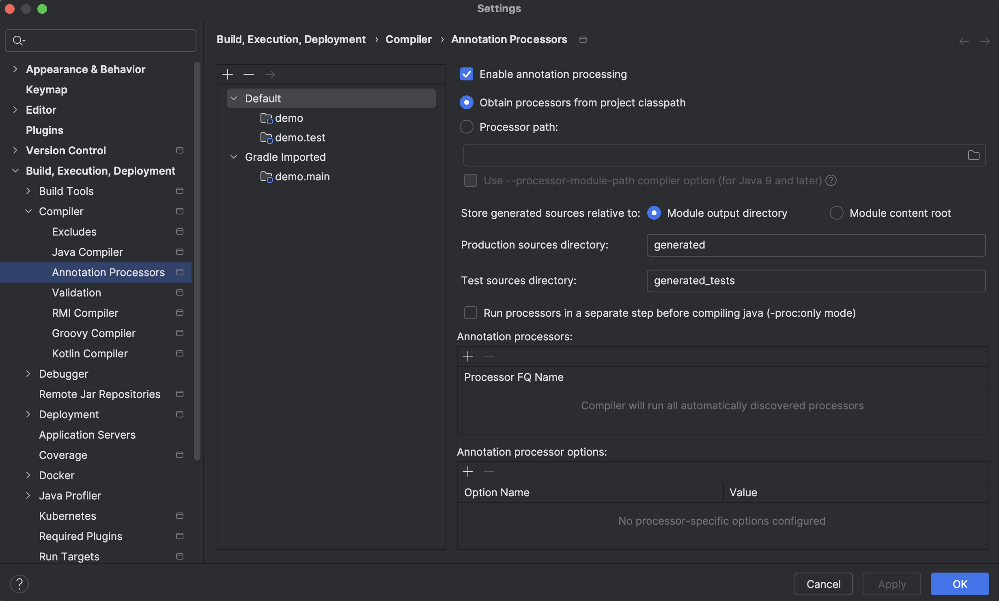

# 프로젝트 만들기 - Spring Boot

## 프로젝트 생성 - IntelliJ Ultimate 버전 기준(하단에 Comunity 버전 기준 생성 방법 기재함)

- File -> New -> Project -> Generator(Spring Boot)
- Java -> Gradle(Grooby) -> temurin17 -> Jar
- Lombok, Spring Web

## Annotation 설정

-> Enable annotation processing 체크



> 📚 Lombok 과 같은 외부 어노테이션 라이브러리가 컴파일 시 문제없이 동작할 수 있도록 함

### What is Lombok

Lombok은 자바 개발에서 반복적으로 작성해야 하는 보일러플레이트 코드를 줄여주는 라이브러리입니다.
이것을 사용하면 자바 클래스에서 필수적으로 작성해야 하는 getter, setter, toString, equlas,
hashCode 등의 메서드를 자동으로 생성해줍니다. 이는 코드의 가독성을 높이고 유지보수를 용이하게 합니다.

#### Lombok 사용법

```java
// 클래스의 모든 필드에 대해 getter와 setter 메서드를 자동으로 생성합니다.
import lombok.Getter;
import lombok.Setter;

@Getter
@Setter
public class Person {
    private String name;
    private int age;
}

// 클래스의 모든 필드를 포함하는 toString 메서드를 자동으로 생성합니다.
import lombok.ToString;

@ToString
public class Person {
    private String name;
    private int age;
}

// equals와 hashCode 메서드를 자동으로 생성합니다.
import lombok.EqualsAndHashCode;

@EqualsAndHashCode
public class Person {
    private String name;
    private int age;
}

// 각각 파라미터가 없는 생성자, 모든 필드를 파라미터로 받는 생성자, final 또는 @NonNull 필드만
// 파라미터로 받는 생성자를 자동으로 생성합니다.
import lombok.NoArgsConstructor;
import lombok.AllArgsConstructor;

@NoArgsConstructor
@AllArgsConstructor
public class Person {
    private String name;
    private int age;
}

// @Data 어노테이션은 @Getter, @Setter, @ToString, @EqualsAndHashCode,
// @RequiredArgsConstructor를 포함하여 모든 보일러플레이트 코드를 자동으로 생성합니다.
import lombok.Data;

@Data
public class Person {
    private String name;
    private int age;
}
```

### 단축키 Tips

- cmd + shift + r: 문구 검색
- shift + shift: 파일, 클래스 검색
- cmd + e: 최근에 검색한 파일 검색
- ctl + option + o: import 정리
- cmd + option + l: 코드 포맷 맞추기
- option + enter: 라이브러리 불러오기
- cmd + option + m: 코드 선택 후 단축키 사용하면 자동으로 메서드 분리

--

## 프로젝트 생성 - IntelliJ Comunity 기준

- start.spring.io 에서 제공하는 initializer 활용합니다.
- 세팅 후 다운로드
- Add dependency

프로젝트가 성공적으로 import 되었다면, IntelliJ 우측 탭에 Gradle 또는 Maven이 생성되어야 합니다.
또한, 커뮤니티 버전의 IntelliJ는 스프링부트 프로젝트를 인식할 수 없어, 실행 설정을 해주어야 합니다.

- 우측 상단 Add Configuration 클릭
- Run/Debug Configurations 화면
- 우측 상단 + 버튼 -> Application 클릭
  - Name
  - 모듈 선택: ex) demo.main
  - 메인 클래스 선택
