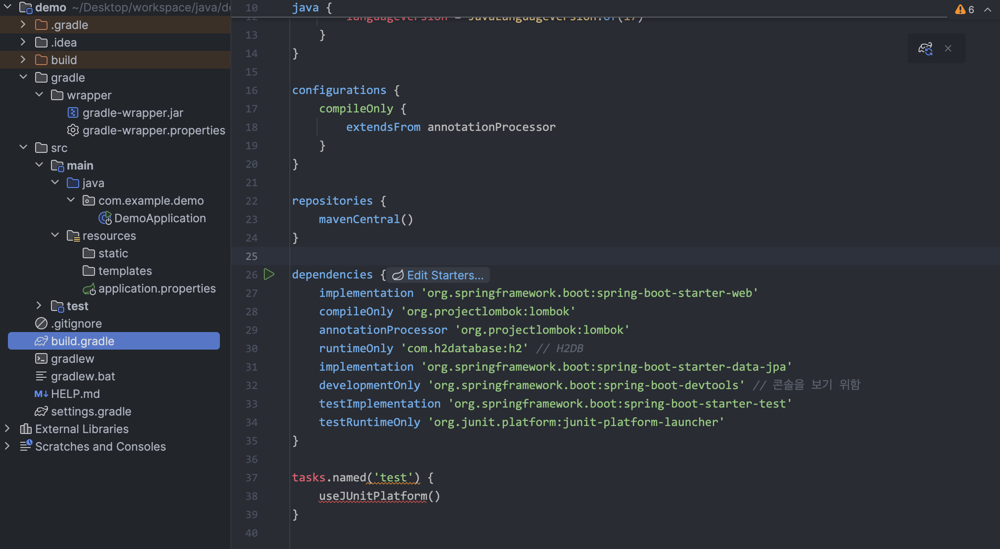
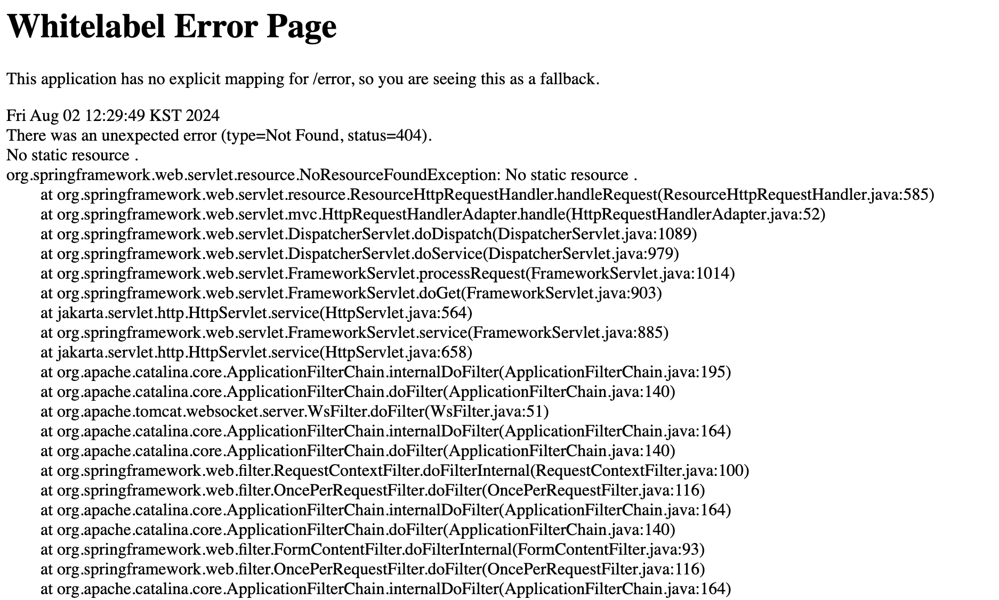
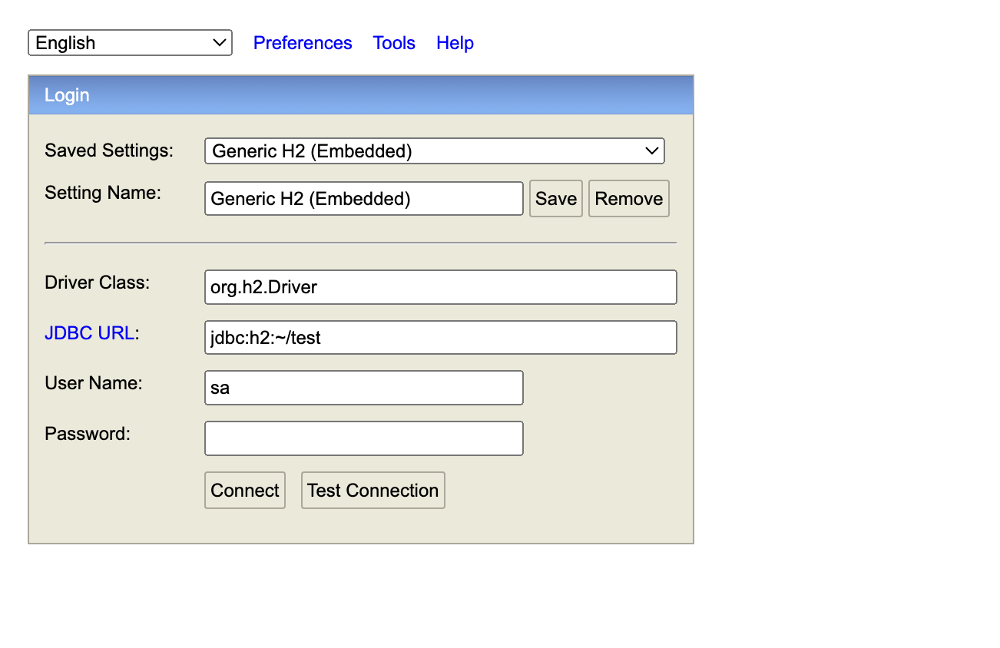
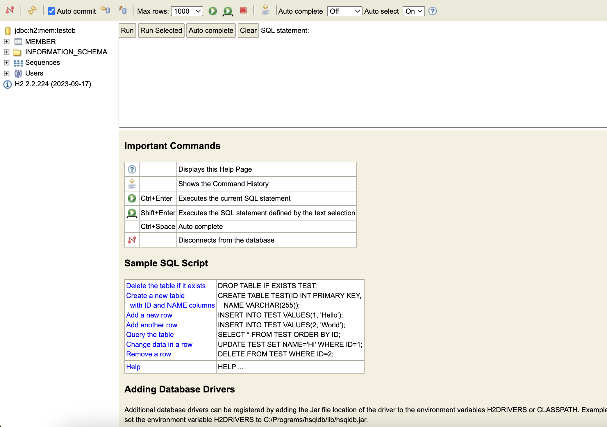

# H2 Database

- Java로 작성된 관계형 데이터베이스 관리 시스템(RDBMS)입니다.
- 오픈소스이며 빠릅니다.
- 인메모리 기반 테이블 & 디스크 기반 테이블에서 생성할 수 있습니다.
  - 인메모리 기반: 앱이 실행이 될 때 DB가 생성되고, 앱이 종료되면 사라짐
  - 디스크 기반: 로컬 환경 어딘가에 파일로 DB정보가 저장되고, 참조하여 실행됨
- 주로 간단한 프로젝트 또는 실습과 테스트에 적용하여 사용하기 좋습니다.

## H2 Database 를 사용하기 위한 Gradle 의존성 추가

아래의 의존성을 build.gradle 에 추가합니다.

- runtimeOnly 'com.h2database:h2'
- spring-boot-devtools
- spring-boot-starter-data-jpa // Dummy Entity를 생성하기 위함

```java
dependencies {
    implementation 'org.springframework.boot:spring-boot-starter-web'
    compileOnly 'org.projectlombok:lombok'
    annotationProcessor 'org.projectlombok:lombok'

    // 추가 start
    runtimeOnly 'com.h2database:h2'
    implementation 'org.springframework.boot:spring-boot-starter-data-jpa'
    developmentOnly 'org.springframework.boot:spring-boot-devtools'
    // 추가 end

    testImplementation 'org.springframework.boot:spring-boot-starter-test'
    testRuntimeOnly 'org.junit.platform:junit-platform-launcher'
}
```



### application yml 파일 만들기

- src -> main -> resource -> application.yml 파일 생성

```yml
spring:
  datasource:
    driver-class-name: org.h2.Driver
    url: jdbc:h2:mem:testdb
    username: sa
  jpa:
    hibernate:
      ddl-auto: create-drop
    show-sql: true
  h2:
    console:
      enabled: true
      settings:
        web-allow-others: true
```

### Dummy JPA Entity 만들기

- src -> main -> java -> com.example.demo
- Member 클래스 생성

```java
package com.example.demo;

import jakarta.persistence.Entity;
import jakarta.persistence.GeneratedValue;
import jakarta.persistence.Id;

@Entity
public class Member {
    @Id
    @GeneratedValue
    private String id;
}
```

## build and run

위의 작업이 끝나면 build 하고 애플리케이션을 실행합니다.

- http://localhost:8080/ 접속
- http://localhost:8080/h2-console 접속




> 일단 Whitelabel Error Page 가 출력되면 정상적으로 실행되었다고 생각하면 됩니다.

### h2-console 접속

Java&Spring Boot 프로젝트가 실행되면 기본적으로 8080포트를 사용하게 됩니다.

- http://localhost:8080
- http://localhost:8080/h2-console


위와 같이 h2-console에 접속이 되었다면 application.yml 파일에 설정한 것과 동일한지 체크한 후
connect 버튼을 클릭하여 접속합니다.

- Driver Class: org.h2.Driver
- JDBC URL: jdbc:h2:mem:testdb
- User Name: sa
- Password:


