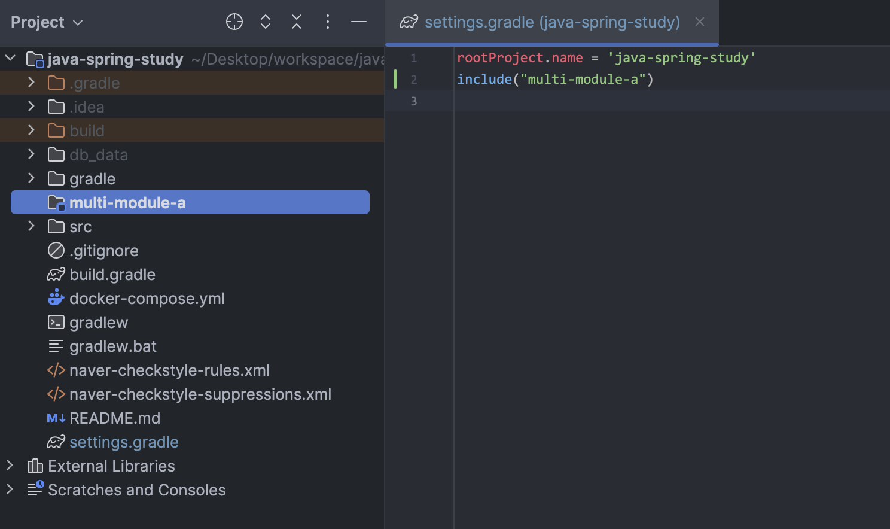
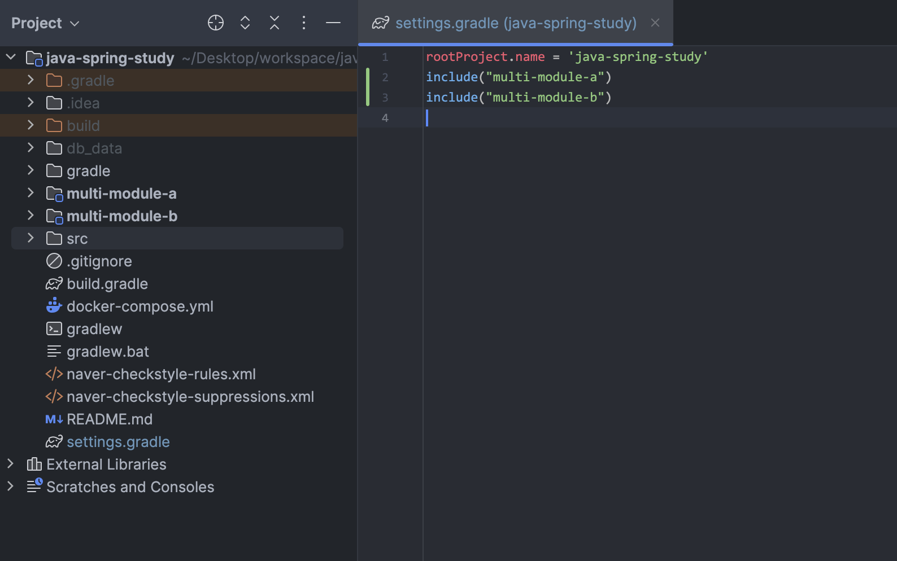
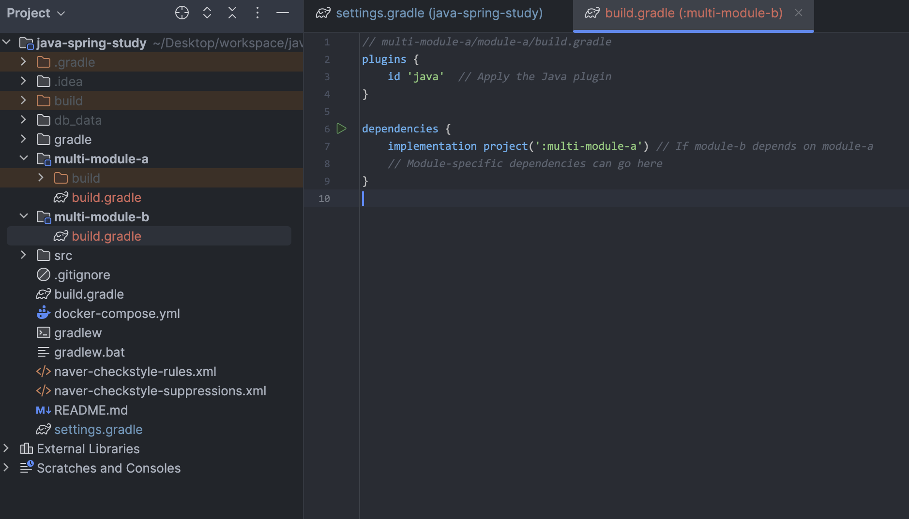

# 멀티 모듈 프로젝트 구성하기

1. 프로젝스 root 에 디렉토리 생성 - multi-module-a

2. settings.gradle 수정

- include("multi-module-a")
  

3. gradle build

- 생성한 디렉토리가 module 로 변경됨
  

4. 각각의 모듈에 build.gradle 생성

ING - 수정 필요
