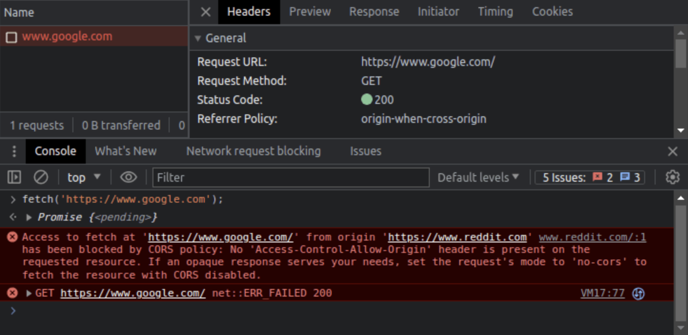

# CORS

## 🧐 What is CORS(Cross-Origin Resource Sharing, 교차 출처 리소스 공유)

웹 브라우저는 보안 상의 이유로 동일 출처 정책(Same-Origin Policy)을 따른다. 이는 한 출처에서
불러온 웹 페이지가 다른 출처의 자원에 접근하는 것을 제한한다. 따라서, 동일 출처 정책은 악성 웹사이트나
스크립트가 쿠키를 사용하여 다른 웹사이트에서 작업을 수행하는 것을 방지하는 보호 계층 중 하나로 작용한다.

CORS는 **이러한 제한을 완화**하기 위해 사용된다.

- 웹 브라우저에 내장되어 있다.
- HTTP 헤더를 기반으로 교차 출처 요청을 허용하는 것이 안전한지 여부를 결정한다.
- CORS는 웹 애플리케이션이 다른 도메인에서 자원을 요청/거부 할 수 있도록 하는 메커니즘이다.



## 👏 CORS 동작 방식

### Preflight Request

OPTIONS 메서드를 사용하여 브라우저가 서버에 실제 요청을 보내기 전에 허용된 메서드와 헤더를 확인한다.

- Access-Control-Allow-Origin: 서버는 이 헤더를 통해 어떤 출처의 요청을 허용할지 명시
- Access-Control-Allow-Methods: 허용된 HTTP 메서드를 명시
- Access-Control-Allow-Headers: 허용된 HTTP 헤더를 명시

예시

```shell
Access-Control-Allow-Origin: https://example.com
Access-Control-Allow-Methods: GET, POST
Access-Control-Allow-Headers: Content-Type
```

## 🧐 What is Origin

Origin은 아래의 구성으로 이루어진 URL의 일부이다.

- 프로토콜(ex: HTTP, HTTPS, ...)
- 도메인(ex: google.com)
- 포트(ex: 443 - SSL(Secure Sockets Layer)을 위한 기본 포트번호)
- ex\) https://google.com:443

HTTPS의 기본 포트는 443이므로 https://google.com 로 단축 할 수 있다.

### ⚡️ 동일한 URL의 예시

- https://google.com
- https://google.com:443
- https://google.com/search?q=test

### ⚡️ 동일하지 않은 URL의 예시

- https://google.com:8080
- https://www.google.com
- http://google.com
- https://reddit.com

### SameSite 쿠키 속성

- 쿠키의 보안 속성
- 쿠키가 다른 출처의 요청에 포함되는 방식을 제어
- SameSite 속성은 CSRF(Cross-Site Request Forgery) 공격을 방지하는 데 도움을 줌

SameSite의 속성 값은 아래와 같다.

#### Strict

- 쿠키는 동일 출처의 요청에만 포함한다.
- 다른 출처에서의 요청은 쿠키를 전송하지 않는다.

#### Lax

- 일부 안전한 크로스사이트 요청(GET 메서드와 같은)에는 쿠키를 포함한다.
- 그 외 다른 유형의 요청에는 포함하지 않는다.

#### None

- 모든 크로스사이트 요청에 쿠키를 포함합니다.
- 이 경우, Secure 속성을 함께 사용해야 합니다.

예시

```shell
Set-Cookie: sessionId=abc123; SameSite=Strict
Set-Cookie: sessionId=abc123; SameSite=Lax
Set-Cookie: sessionId=abc123; SameSite=None; Secure
```

### CORS와 SameSite의 관련성

- CORS: 클라이언트와 서버 간의 요청을 제어하여 크로스 도메인 요청을 안전하게 허용하는 데 사용
- SameSite: 쿠키의 포함 여부를 제어하여 CSRF 공격을 방지하는 데 사용

- CORS: HTTP 요청 헤더와 응답 헤더를 통해 작동하며, 브라우저와 서버 간의 상호작용에 영향
- SameSite: 쿠키의 속성으로 작동하며, 특정 조건에서 쿠키가 전송되는 방식을 제한

두 메커니즘 모두 다른 출처 간의 상호작용을 제어하여 보안을 강화하지만, 각기 다른 레벨에서 작동한다.
CORS는 서버 측 설정을 통해 클라이언트의 요청을 허용 또는 거부하는 역할을 하며, 주로 API 호출과 같은
HTTP 요청에 적용된다. SameSite는 클라이언트 측에서 쿠키의 전송을 제어하여 특정 상황에서의 보안을
강화합니다.

### 예시로 본 관계

웹 애플리케이션이 https://example.com 도메인에 있고, 이 애플리케이션이
https://api.example.com에서 자원을 요청한다고 가정한다.

#### CORS 설정

https://api.example.com 서버는 https://example.com에서 오는 요청을 허용하도록 CORS 헤더를
설정한다.

```shell
Access-Control-Allow-Origin: https://example.com
```

#### SameSite 설정

https://example.com에서 사용되는 쿠키는 SameSite=Lax 또는 SameSite=None; Secure 속성을
통해 크로스사이트 요청에도 포함될 수 있게 설정할 수 있다.

```shell
Set-Cookie: sessionId=abc123; SameSite=None; Secure
```

이처럼 CORS는 서버 간의 HTTP 요청을 제어하고, SameSite는 클라이언트 측에서 쿠키의 포함 여부를
제어하여, 둘 다 웹 애플리케이션의 보안을 강화하는 중요한 역할을 한다.

### Preflight requests

웹 애플리케이션에서 CORS (Cross-Origin Resource Sharing)를 사용할 때, 브라우저가 실제 요청을
보내기 전에 서버가 해당 요청을 허용하는지 확인하기 위해 보내는 HTTP 요청이다. 이는 보안 목적으로 특정한
조건을 만족하는 크로스 도메인 요청에 대해 브라우저가 자동으로 수행합니다.

> 📚 Preflight 요청이 필요한 경우
>
> - 커스텀 헤더 사용: Authorization과 같은 표준 헤더 외에 커스텀 헤더를 사용하는 경우.
> - 비표준 메서드 사용: GET, POST 외의 메서드(PUT, DELETE 등)를 사용하는 경우.
> - Content-Type이 application/x-www-form-urlencoded, multipart/form-data,
>   text/plain가 아닌 경우: 예를 들어, application/json을 사용하는 경우.

#### Preflight 요청의 목적

- 서버의 허용 여부 확인: 브라우저가 특정 출처에서 오는 요청이 허용되는지 확인
- HTTP 메서드 및 헤더 확인: 요청에 사용된 HTTP 메서드와 헤더가 허용되는지 확인
- 보안 강화: 민감한 요청이 의도치 않게 서버로 전송되지 않도록 보장

#### Preflight 요청의 동작 방식

- OPTIONS 메서드 사용: Preflight 요청은 항상 HTTP OPTIONS 메서드를 사용
- CORS 헤더 포함:
  - 브라우저는 요청에 Origin, Access-Control-Request-Method,
    Access-Control-Request-Headers 등의 헤더를 포함한다.

클라이언트 요청

```js
fetch('https://api.example.com/data', {
  method: 'POST',
  headers: {
    'Content-Type': 'application/json',
    'X-Custom-Header': 'value',
  },
  body: JSON.stringify({ key: 'value' }),
});
```

Preflight 요청 - 브라우저는 위의 요청을 보내기 전에 다음과 같은 Preflight 요청을 보낸다.

```js
OPTIONS /data HTTP/1.1
Host: api.example.com
Origin: https://example.com
Access-Control-Request-Method: POST
Access-Control-Request-Headers: Content-Type, X-Custom-Header
```

서버 응답 - 서버는 다음과 같이 응답할 수 있다.

```js
HTTP/1.1 204 No Content
Access-Control-Allow-Origin: https://example.com
Access-Control-Allow-Methods: POST
Access-Control-Allow-Headers: Content-Type, X-Custom-Header
Access-Control-Max-Age: 86400
```

#### Preflight 요청 최적화

```shell
Access-Control-Max-Age: 86400
```

- 이 헤더를 사용하여 Preflight 요청의 응답을 캐시할 수 있다.
- 이렇게 하면 동일한 요청에 대해 반복적인 Preflight 요청을 피할 수 있습니다.
